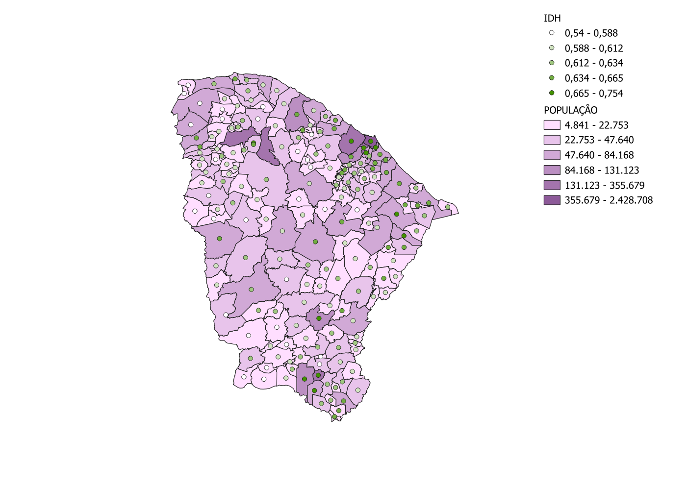

# Trabalho Prático - Banco de Dados Geogtáficos

## Integrantes

* João Lucas Lage Gonçalves - 2020054552
* João Vítor Bicalho da Silva - 2020054579
* Pedro Renato Ferreira da Silva - 2020054757

## Introdução

Este trabalho tem como objetivo colocar em prática conceitos e princípios discutidos ao longo da disciplina usando dados de votação, mantidos pelo Tribunal Superior Eleitoral.

Nosso grupo ficou responsável por analisar os dados de votação para Deputados Federias das eleições de 2022, no estado do Ceará, e relacioná-los com dados geográficos do estado.

A primeira etapa desse trabalho foi feita usando o [Github](https://github.com/JoaoLucas23/BDG) para armazenamento dos arquivos e engenharia de dados, e o [OMT-G Designer](http://aqui.io/omtg/#) para a construção do Banco de Dados Geográficos.

## Metodologia

### 1. Aquisição de dados

Nessa etapa realizamos a coleta dos dados necessários para as análises.Foram coletados os seguintes dados:

* [Dados de votação para Deputados Federais no estado do Ceará, nas eleições de 2022, disponíveis no site do TSE.](https://www.tse.jus.br/eleicoes/estatisticas/repositorio-de-dados-eleitorais-1/repositorio-de-dados-eleitorais)
* [Dados do Censo de 2022, disponíveis no site do IBGE.](https://www.ibge.gov.br/estatisticas/sociais/populacao/22827-censo-demografico-2022.html?edicao=39499&t=resultados)
* [Dados do IDH municipal no ano de 2010, disponíveis no site da Fundação João Pinheiro.](http://www.atlasbrasil.org.br/consulta/planilha)
* [Dados geográficos do estado do Ceará disponíveis no site do IPEA.](https://basedosdados.org/dataset/49ace9c8-ae2d-454b-bed9-9b9492a3a642?table=830ed269-41f9-461d-96f1-6a54b2e574ac)
* [Dados de furtos no estado do Ceará entre 2013 e 2022, disponíveis no site da SSP-CE.](https://www.sspds.ce.gov.br/indicadores-de-seguranca-publica/)

Os dados foram coletados em formato CSV e estão disponíveis na pasta `dados`.

### 2. Construção do BDG e Engenharia de Dados

Essa etapa foi dividida em duas partes: a Engenharia de Dados e a construção do Banco de Dados Geográficos.

#### Engenharia de Dados

A engenharia de dados foi realizada no arquivo `tratamento_de_dados.ipynb`. Nesse arquivo, realizamos a limpeza e transformação dos dados de votação, censo, IDH e furtos, para que eles pudessem ser inseridos no Banco de Dados Geográficos. Além disso foi feita uma análise exploratória inicial dos dados a fim de verificar as estatísticas básicas sobre os dados.

1. Carregamento dos dados
2. Padronização de nomes e tipos de dados das colunas
3. Filtragem dos dados
4. Agregação dos dados
5. Exploração dos dados
6. Construção das tabelas do Banco de Dados Geográficos

#### Esquema OMT-G  
O diagrama construído pode ser melhor visualizado acessando o arquivo `OMT-G.pdf`

### 3. Análises

#### Correlação com dados socioeconômicos

Para essa análise selecionamos um candidato a deputado federal pelo partido PL, André Fernandes, e outro do PT, José Nobre Guimarães. Ambos representam espectros políticos opostos e tiveram votações expressivas.

Considerando as variáveis `total de votos` e `idh` por cidade, obtivemos os seguintes coeficientes de correlação de Pearson:
-  Candidato Andre - Coeficiente de Correlação de Pearson: 0.40341885945941275
- Candidato José - Coeficiente de Correlação de Pearson: 0.30443282422165246

Os coeficientes obtidos indicam inicilamente que não há uma correlação entre as variáveis de idh e total de votos em cada cidade.  No entanto, também foram obtidos p-values extremamente próximos de sero, ou seja, tais coeficientes não são estatisticamente significativos.

Observando os gráficos de dispersão, podemos extrair algumas outras informações interessantes:

Nota-se que o candidato José possui uma quantidade de votos maior em cidades com IDH menor

No caso do candidato André, há uma grande parcela de votos na cidade de maior IDH, Fortaleza.

### 4. Visualização

A parte de visualização foi realizada utilizando o software QGIS, que permitiu transformar os dados tratados em representações geográficas e analíticas. Para isso, foi necessário importar os arquivos `.csv` na pasta `tabela` para o banco de dados PostgreSQL, o que viabilizou a organização e manipulação dos dados. Em seguida, o QGIS foi conectado ao banco de dados para facilitar o uso de camadas geográficas e temáticas.

Os arquivos na pasta `camadas` contêm os dados processados em formato compatível para serem usados como camadas no QGIS. Esses dados foram organizados de forma a permitir a visualização de indicadores e comparações relevantes. Além disso, os arquivos `.qgz` contêm projetos do QGIS com todas as camadas já carregadas e configuradas, permitindo replicar ou ajustar as análises com facilidade.

#### a. Propósito da Visualização

As visualizações foram desenvolvidas para explorar as relações entre os indicadores socioeconômicos, como IDH e população, e os dados eleitorais e de segurança pública. A intenção foi identificar padrões geográficos que pudessem apoiar estudos políticos e sociais, além de compreender a distribuição de variáveis como votos por partido e quantidade de furtos nos municípios.

#### b. Escolha do Plano de Fundo

Foi utilizado um mapa base padrão com a delimitação dos municípios, com ênfase nos limites municipais do estado do Ceará. A escolha garantiu que as camadas de dados, como IDH, população, furtos e votação, pudessem ser facilmente identificadas e interpretadas.

#### c. Escolha de Parâmetros Gráficos/Visuais

* Paleta de Cores: Tons contrastantes foram usados para representar diferentes categorias, como partidos políticos (cores ligadas ao partido) ou indicadores sociais, garantindo distinção visual clara.
* Tamanhos e Formatos de Símbolos: Dados quantitativos, como população e quantidade de furtos, foram representados por círculos proporcionais ao valor. Dados categóricos, como partidos vencedores, foram exibidos por preenchimento colorido das áreas municipais.
* Legendas e Rotulação: Cada visualização foi acompanhada de legendas e rótulos claros, permitindo fácil interpretação das informações exibidas.

#### d. Processo de Produção

* Software Utilizado: O QGIS foi a ferramenta principal, dada sua robustez para lidar com dados geográficos e a facilidade de integração com o banco de dados PostgreSQL.
* Etapas do Processo:
  * Os dados tratados na etapa de engenharia foram organizados em tabelas e importados para o banco PostgreSQL.
  * Os arquivos da pasta tabela foram utilizados para criar camadas temáticas no QGIS.
  * As camadas foram configuradas para representar indicadores específicos, como população, IDH e votação por candidatos e partidos.
  * Projetos no formato .qgz foram criados, com todas as configurações de simbologia e camadas salvas para futura replicação ou ajustes.

#### 4.1 Dados Gerais

| |  |
|--------------------------------|--------------------------------|
| Visualização da relação entre tamanho da população e IDH dos municípios do Ceará.                  | Visualização da relação entre quantidade de furtos e IDH dos municípios do Ceará.                  |

As visualizações acima mostram padrões importantes: municípios com maior população aparentam ter um IDH mais alto, indicando uma correlação positiva entre esses fatores. Por outro lado, a relação entre a quantidade de furtos e o IDH não apresenta uma correlação clara. Diferente do que poderia ser esperado, municípios com menor IDH não necessariamente apresentam maior taxa de furtos.

#### 4.2 Dados de Votação - Candidatos

Comparação de municípios com mais votos entre os candidatos Jeziel (eleito com menor número de votos) e Denis (não eleito com maior número de votos).

|  |  |
|--------------------------------|--------------------------------|
| Quantidade de votos por município do candidato Jeziel...                  |      Quantidade de votos por município do candidato Denis            |

As visualizações acima revelam diferenças marcantes entre as estratégias e resultados dos dois candidatos. Jeziel, que foi eleito com o menor número de votos, concentrou sua votação em municípios de maior população, com uma distribuição mais pulverizada em relação à quantidade de municípios. Já Denis, que não foi eleito apesar de possuir maior número total de votos, teve uma votação concentrada em poucos municípios, predominantemente de menor população.

#### 4.3 Dados de Votação - Partidos

Partido vencedor por município.

|  |  |
|--------------------------------|--------------------------------|
| Comparação entre partido vencedor e população do município.                  |      Comparação entre partido vencedor e IDH do município.           |

As visualizações destacam a predominância do Partido Liberal (PL) em municípios de população média a grande, garantindo o maior número de votos totais. O Partido Democrático Trabalhista (PDT), por sua vez, obteve vitórias em municípios com grande população, assegurando a segunda posição no número total de votos. No entanto, ao analisar a relação entre o partido vencedor e o IDH dos municípios, não se observa uma correlação clara, indicando que outros fatores podem influenciar os resultados eleitorais.
